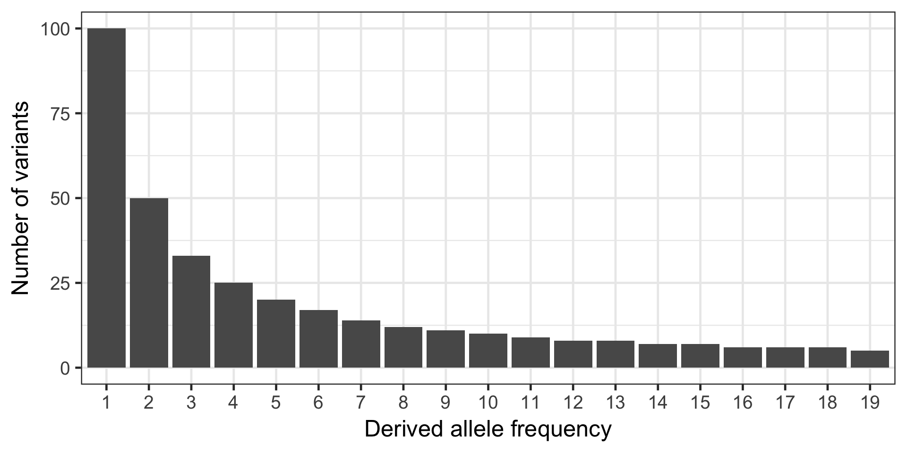

# anavar_utils - a python package for creating control files and analysing results from anavar

## Introduction

anavar_utils is a python package designed to facilitate the easy creation of 
control files for anavar ([Barton and Zeng, 2018]()) as well as providing classes 
for the easy interpretation of anavar's results files.

Anavar is available [here](), the manual describes in detail the models available 
and the paramters in the control files in more extensive detail than in these docs.

To use the package to create a simple control file:

```python
from __future__ import print_function
import anavar_utils as an

# data needed for anavar, SFS, callable sites and sample size
sample_size = 10
site_frequencies = [20, 19, 18, 17, 16, 15, 2, 1]
n_sites = 10000

# anavar_utils takes the sfs data in a dictionary
sfs_dict = {'SNP': (site_frequencies, n_sites)}

# intiate control file instance
control_file = an.Snp1ControlFile()

# set the data
control_file.set_data(sfs_dict, sample_size)

# construct control file string
control_contents = control_file.construct()

# output to a file or to stdout
print(control_contents)
```

This gives:

```
[algorithm_commands]
search_algorithm: NLOPT_LD_LBFGS
maxeval: 100000
maxtime: 600
num_searches: 500
nnoimp: 1
maximp: 3
optional: false

[model_commands]
model: SNP_1
n: 17
m: 10000
folded: false
sfs: 20, 19, 18, 17, 16, 15, 2, 1
dfe: discrete
c: 1
theta_range: 1e-06, 0.1
gamma_range: -250, 10
e_range: 0.0, 0.5
constraint: none

```

## API

### Control Files

#### Site frequency data format

In its simplest form a control file can be created for a given model 
with only the site frequency spectrum, the number of callable sites 
(in some cases and if per site parameter estimates are not required 
this can be set to 0) and the sample size. The control file classes 
take this data (using the ```.set_data()``` method) in the form of a 
dictionary, with keys specific to each model, as show in the table 
below.

| model  | dictionary format |
|:-------|:------------------|
| SNP_1  |```{'SNP': (sfs, n_sites)}``` |
| INDEL_1 | ```{'INS': (sfs, n_sites), 'DEL': (sfs, n_sites)}``` |
| gBGC_GLEMIN_EXTENDED_M1* | ```{'neutral_SNPs': (sfs, n_sites), 'ws_SNPs': (sfs, n_sites), 'sw_SNPs': (sfs, n_sites)}``` |
| neutralINDEL_vs_selectedINDEL | ```{'neutral_INS': (sfs, n_sites), 'neutral_DEL': (sfs, n_sites), 'selected_INS': (sfs, n_sites), 'selected_DEL': (sfs, n_sites)}``` |
| neutralSNP_vs_selectedSNP | ```{'neutral_SNP': (sfs, n_sites), 'selected_SNP': (sfs, n_sites)}``` |

The site frequency data needs to provide in the form of frequency counts 
from low freq to high freq with frequencies with no variants entered as 0.
For example this site frequency spectrum (SFS):



Would be expressed as:

```python
sfs = [100, 50, 33, 25, 20, 17, 14, 12, 11, 10, 9, 8, 8, 7, 7, 6, 6, 6, 5]
```


### Results Files